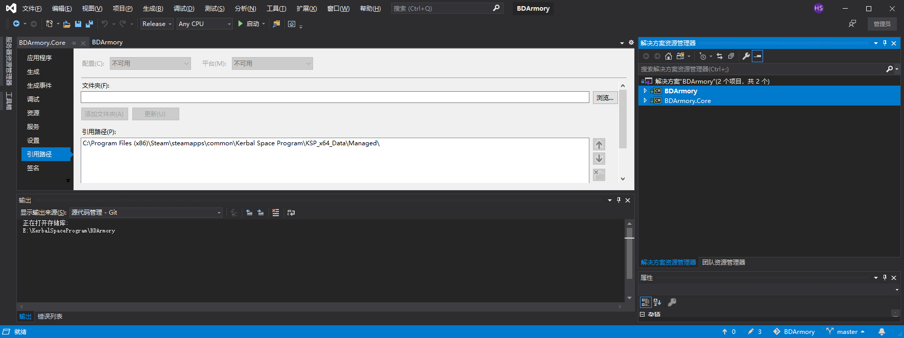
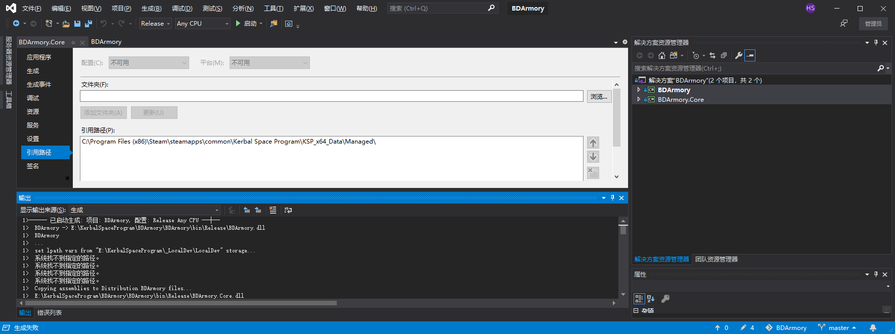

BDArmory
========

Gun turrets and other weapon systems for KSP

Original Author [BahamutoD](https://github.com/BahamutoD)

Original [Forum link](http://forum.kerbalspaceprogram.com/threads/85209-BDArmory)

Current [Forum link](https://forum.kerbalspaceprogram.com/index.php?/topic/184167-17x-bdarmory-continued-v130-05012019/)

Current Maintainers:
- [PapaJoe](https://github.com/PapaJoesSoup)
- [jrodrigv](https://github.com/jrodrigv)
- [SpannerMonkey](https://github.com/SpannerMonkey)
- [gomker](https://github.com/gomker)
- [TheDog](https://github.com/TheDogKSP)
- [DoctorDavinci](https://github.com/DoctorDavinci)

Contribution Guidance
========
The BDA Team uses a Fork / Branch Workflow. If you would like to contribute to the project please use the following guides 

https://help.github.com/articles/fork-a-repo/

https://help.github.com/articles/creating-a-pull-request-from-a-fork/

We only accept Pull Request to the "dev" Branch. 
It is preferred that any major changes use thier own separate branch with the naming convention Feature_<feature description>

The "support" Branch is for bug fixes in between releases 

Finally the "master" branch is the latest release and considered production

Licensing
========
This mod for Kerbal Space Program was originally developed by Paolo Encarnacion (BahamutoD) and distributed under the license CC-BY-SA 2.0.
This mod is now being maintained in BahamutoD's absence by Joe Korinek (Papa_Joe) and continues to be distributed under the license CC-BY-SA 2.0.
Please read about the license at
https://creativecommons.org/licenses/by-sa/2.0/
before attempting to modify and redistribute it.

-----

小咩的补充:

编译操作:

- 装vs2019
- 双击\BDArmory\BDArmory.sln打开
  - 可能提示缺.net库 会弹出链接 在弹出的链接里下载对应版本的库 一路next安装即可
- 

右边我选中(标蓝)的那2行字上分别右键点属性 左面就会弹出如图界面 "文件夹处填ksp安装路径下的KSP_x64_Data\Managed\文件夹 然后点添加文件夹

最上面debug改成release 然后按f7编译

会报错7za啥啥找不着 不用管 已经编译成功了

然后

BDArmory\Distribution文件夹里东西贴进KSP的gamedata文件夹就可以用了

